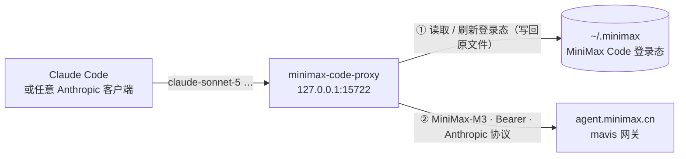

<div align="center">


# minimax-code-proxy

**把已登录的 MiniMax Code 账号，变成 Claude Code 能直接用的本地 Anthropic 端点**

<a href="https://github.com/KirishimaEri/minimax-code-proxy/releases/latest"></a>
<a href="https://nodejs.org"></a>
<a href="LICENSE"></a>


[特性](#-特性) · [工作原理](#-工作原理) · [快速开始](#-快速开始) · [配置与映射](#-配置与模型映射) · [常见问题](#-常见问题)

`免 API Key` `登录态自动续期` `标准 Anthropic 协议 + SSE` `单文件 · 零依赖` `cn / global 双区`

</div>

---

**minimax-code-proxy** 是一个单文件本地网关：它复用 MiniMax Code（桌面版 / `mcode` CLI）的 OAuth 登录态，在本机 `127.0.0.1:15722` 起一个标准 **Anthropic Messages** 端点，并把 `claude-*` 等模型名自动映射到 MiniMax-M\*——Claude Code 等客户端**无需 API Key** 即可直接使用 MiniMax 模型。

> ⚠️ 本项目与 MiniMax、Anthropic **均无关联**，仅供个人学习研究；请遵守 MiniMax 服务条款，共享 / 转售额度有封号风险。

## 目录

- [✨ 特性](#-特性)
- [🔎 工作原理](#-工作原理)
- [🚀 快速开始](#-快速开始)
- [🧩 配置与模型映射](#-配置与模型映射)
- [📮 端点](#-端点)
- [❓ 常见问题](#-常见问题)
- [🛡️ 安全与免责](#️-安全与免责)
- [🌿 同类项目](#-同类项目)
- [📄 许可证](#-许可证)

## ✨ 特性

- 🗝️ **免 API Key** — 直接使用 MiniMax Code 的登录态，不需要去控制台申请密钥。
- 🔁 **登录态自动续期** — access token 约 1 小时过期且 refresh token 每次轮换，代理自动刷新并**原子写回**凭据文件，与 MiniMax Code 客户端共用同一份登录态、互不干扰。
- 📡 **标准 Anthropic 协议** — `/v1/messages`、`/v1/messages/count_tokens`、`/v1/models`，流式为标准 Anthropic SSE 透传。
- 🏷️ **模型映射** — 客户端发 `claude-sonnet-5`、`claude-haiku-4-5` 等名字也能路由到合适的 MiniMax 模型。
- 🌏 **cn / global 双区** — 自动适配 `agent.minimax.{cn,io}` 上游与对应凭据路径。
- 🪶 **单文件零依赖** — 一个 `proxy.mjs`，Node.js ≥ 18 即可运行。

## 🔎 工作原理



MiniMax Code 的登录态存在 `~/.minimax/auth/prod/<区>/mcode-public/auth.json`，其中 access token 约 1 小时过期，**且每次刷新都会轮换 refresh token**。本代理：

- 每次请求前检查有效期，不够则刷新并**原子写回同一文件**（同时同步 `auth-state.json` 的 generation / expiresAtMs），因此 MiniMax Code 桌面版与本代理可以共存，互不踢下线；
- 收到上游 401 时自动强制刷新并重试一次；
- 若持续 401（`invalid_grant`），说明登录已失效——重新登录桌面版或执行 `mcode login` 即可。

## 🚀 快速开始

1. 登录 MiniMax Code（桌面版，或 CLI `mcode login`）；
2. 启动代理并自检：

   ```bash
   node proxy.mjs
   curl http://127.0.0.1:15722/health
   ```

3. 配置 Claude Code：

   ```bash
   export ANTHROPIC_BASE_URL=http://127.0.0.1:15722
   export ANTHROPIC_AUTH_TOKEN=anything   # 代理不校验客户端凭据
   ```

任何支持自定义 Anthropic base URL 的工具（CC Switch、OpenCode 等）都按同样方式接入。`mcode login --region global` 登录的账号，在 `config.json` 里设 `{"region": "global"}` 即可。

> **Windows 开机自启**：用 `wscript` 跑一个隐藏启动脚本（`start-hidden.vbs`）：
> `CreateObject("WScript.Shell").Run """node"" ""<本项目路径>\proxy.mjs""", 0, False`

## 🧩 配置与模型映射

所有配置项均可省略；新建 `config.json`（参考 `config.example.json`）可覆盖：

| 键 | 默认 | 说明 |
|---|---|---|
| `port` / `host` | `15722` / `127.0.0.1` | 监听地址 |
| `region` | `cn` | `cn` 或 `global`，决定上游与凭据路径 |
| `upstream` / `oauthTokenEndpoint` | 按 region | 上游网关与 OAuth 刷新端点，一般不用改 |
| `authFile` / `stateFile` | 按 region | MiniMax Code 凭据文件路径 |
| `models` | 4 个 M 系模型 | 可透传的模型白名单 |
| `defaultModel` / `fastModel` | `MiniMax-M3` / `MiniMax-M3.1-Flash-Preview` | 映射目标 |
| `refreshSkewMs` | `120000` | 提前多少毫秒视为「将过期」 |
| `logFile` | `./proxy.log` | 日志文件（超 5 MB 自动轮转） |

模型映射规则：

| 客户端请求 | 实际转发 |
|---|---|
| `MiniMax-*`（在 `models` 列表内） | 原样透传 |
| 名字含 `haiku` / `flash` / `highspeed` | `fastModel` |
| 其余（`claude-sonnet-5`、`claude-opus-5`、未知） | `defaultModel` |

## 📮 端点

| 方法 | 路径 | 说明 |
|:---:|---|---|
| POST | `/v1/messages` | Anthropic Messages（支持 `stream: true`） |
| POST | `/v1/messages/count_tokens` | token 计数透传 |
| GET | `/v1/models` | 模型列表 |
| GET | `/health` | token 剩余有效期、generation、最近一次模型映射 |

## ❓ 常见问题

<details>
<summary><b>🔑 一直 401 / 提示重新登录</b></summary>

登录态已失效（`invalid_grant`）。重新登录 MiniMax Code 桌面版，或执行 `mcode login`；`GET /health` 可随时查看当前凭据状态。
</details>

<details>
<summary><b>🚦 端口被占用</b></summary>

改 `config.json` 的 `port`，并同步修改客户端里的 base URL。
</details>

<details>
<summary><b>🖥️ Claude Desktop 怎么接</b></summary>

Claude Desktop 的 3P 模式需要经 CC Switch 之类的网关做模型路由，把网关上游指向本代理（`http://127.0.0.1:15722`）即可。
</details>

<details>
<summary><b>🗝️ 为什么不用官方订阅 Key</b></summary>

如果你在 MiniMax 控制台能签发订阅 Key（`sk-cp-` 前缀），直接设 `ANTHROPIC_BASE_URL=https://api.minimax.io/anthropic` 是更简单的官方路径，无需本项目；本项目面向「只有 MiniMax Code 登录态、没有独立 Key」的场景。
</details>

## 🛡️ 安全与免责

- 服务只监听 `127.0.0.1`，但**本机任意进程都可以调用它**，请勿将端口暴露到局域网 / 公网。
- 凭据仅用于与 MiniMax 官方端点通信，不会发送到任何第三方。
- 额度即你自己的订阅额度；**共享、转售、多人拼车有封控 / 封号风险**，后果自负。

## 🌿 同类项目

[cc-switch](https://github.com/farion1231/cc-switch)、[claude-code-router](https://github.com/musistudio/claude-code-router)、[cc-router](https://github.com/finch-xu/cc-router) 等也支持把 MiniMax 官方端点接入各类客户端；本项目的差异点是**免 Key 复用 MiniMax Code 登录态**，并处理其「1 小时过期 + refresh token 轮换」的完整生命周期。

## 📄 许可证

本项目以 [MIT 许可证](LICENSE) 开源。

<div align="center">
  <sub>如果这个项目帮到了你，欢迎点一个 ⭐。</sub>
</div>
