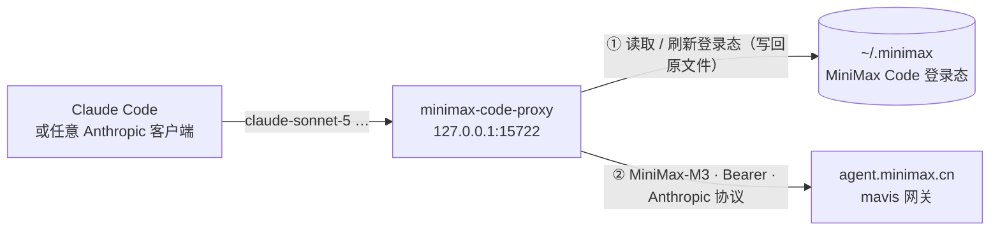

<div align="center">


# minimax-code-proxy

**把已登录的 MiniMax Code 账号，变成 Claude Code 能直接用的本地 Anthropic 端点**

<a href="https://github.com/KirishimaEri/minimax-code-proxy/releases/latest"></a>
<a href="https://nodejs.org"></a>
<a href="LICENSE"></a>


[特性](#-特性) · [工作原理](#-工作原理) · [快速开始](#-快速开始) · [配置与映射](#-配置与模型映射) · [常见问题](#-常见问题)

`免 API Key` `登录态自动续期` `每日自动签到` `多账号轮询` `标准 Anthropic 协议 + SSE` `单文件 · 零依赖`

</div>

---

**minimax-code-proxy** 是一个单文件本地网关：它复用 MiniMax Code（桌面版 / `mcode` CLI）的 OAuth 登录态，在本机 `127.0.0.1:15722` 起一个标准 **Anthropic Messages** 端点，并把 `claude-*` 等模型名自动映射到 MiniMax-M\*——Claude Code 等客户端**无需 API Key** 即可直接使用 MiniMax 模型。

> ⚠️ 本项目与 MiniMax、Anthropic **均无关联**，仅供个人学习研究；请遵守 MiniMax 服务条款，共享 / 转售额度有封号风险。

## 目录

- [✨ 特性](#-特性)
- [🔎 工作原理](#-工作原理)
- [🚀 快速开始](#-快速开始)
- [⏰ 自动签到](#-自动签到)
- [👥 多账号轮询](#-多账号轮询)
- [🧩 配置与模型映射](#-配置与模型映射)
- [📮 端点](#-端点)
- [❓ 常见问题](#-常见问题)
- [🛡️ 安全与免责](#️-安全与免责)
- [🌿 同类项目](#-同类项目)
- [📄 许可证](#-许可证)

## ✨ 特性

- 🗝️ **免 API Key** — 直接使用 MiniMax Code 的登录态，不需要去控制台申请密钥。
- 🔁 **登录态自动续期** — access token 约 1 小时过期且 refresh token 每次轮换，代理自动刷新并**原子写回**凭据文件，与 MiniMax Code 客户端共用同一份登录态、互不干扰。
- 📡 **标准 Anthropic 协议** — `/v1/messages`、`/v1/messages/count_tokens`、`/v1/models`，流式为标准 Anthropic SSE 透传。
- 🏷️ **模型映射** — 客户端发 `claude-sonnet-5`、`claude-haiku-4-5` 等名字也能路由到合适的 MiniMax 模型。
- 🌏 **cn / global 双区** — 自动适配 `agent.minimax.{cn,io}` 上游与对应凭据路径。
- ⏰ **每日自动签到** — 等价于 mcode 客户端 `/checkin` 命令的每日积分领取，按账号自动执行，也可 `POST /checkin` 手动触发。
- 👥 **多账号轮询** — 配置多个 MiniMax Code 数据目录，请求按 round-robin 轮换，遇 401 / 429 自动切换到下一个账号。
- 🪶 **单文件零依赖** — 一个 `proxy.mjs`，Node.js ≥ 18 即可运行。

## 🔎 工作原理



MiniMax Code 的登录态存在 `~/.minimax/auth/prod/<区>/mcode-public/auth.json`，其中 access token 约 1 小时过期，**且每次刷新都会轮换 refresh token**。本代理：

- 每次请求前检查有效期，不够则刷新并**原子写回同一文件**（同时同步 `auth-state.json` 的 generation / expiresAtMs），因此 MiniMax Code 桌面版与本代理可以共存，互不踢下线；
- 收到上游 401 时自动强制刷新并重试一次；
- 若持续 401（`invalid_grant`），说明登录已失效——重新登录桌面版或执行 `mcode login` 即可。

## 🚀 快速开始

1. 登录 MiniMax Code（桌面版，或 CLI `mcode login`）；
2. 启动代理并自检：

   ```bash
   node proxy.mjs
   curl http://127.0.0.1:15722/health
   ```

3. 配置 Claude Code：

   ```bash
   export ANTHROPIC_BASE_URL=http://127.0.0.1:15722
   export ANTHROPIC_AUTH_TOKEN=anything   # 代理不校验客户端凭据
   ```

任何支持自定义 Anthropic base URL 的工具（CC Switch、OpenCode 等）都按同样方式接入。`mcode login --region global` 登录的账号，在 `config.json` 里设 `{"region": "global"}` 即可。

> **Windows 开机自启**：用 `wscript` 跑一个隐藏启动脚本（`start-hidden.vbs`）：
> `CreateObject("WScript.Shell").Run """node"" ""<本项目路径>\proxy.mjs""", 0, False`

## ⏰ 自动签到

MiniMax Code 客户端里有个 `/checkin` 命令，每天可领一次积分（7 天一循环）。本代理实现了同一套接口与签名：

- **开启**：在 `config.json` 里设 `"checkin": { "enabled": true }`（默认关闭）；
- **自动执行**：启动后与每 30 分钟（`checkin.intervalMinutes` 可调）检查一次，当天未领则领取；结果记在 `checkin-state.json`（已被 gitignore）；
- **手动触发**：`curl -X POST http://127.0.0.1:15722/checkin`，立即对全部账号执行一遍；
- **结果语义**：`claimed`（领取成功，含 `points`）、`already`（今日已领）、`not-claimable`（服务端判定当前不可领）、`error`（瞬时失败，下个周期自动重试）。实现上直接调用 claim 接口、由服务端裁决（status 面板数据易变，claim 结果才是权威的）。

**`userId` 说明**：签到请求带账号的 `realUserID` 作为客户端归因字段。用 `mcode` CLI 登录的数据目录会自动从 `cli-auth/.../account-identity.json` 读取；桌面版登录的目录需要在 `accounts[].userId` 里手动填（桌面版配置 `minimax-agent-cn-config.json` 的 `sharedUser.realUserID`）。

## 👥 多账号轮询

MiniMax Code 官方的多账号方式是**多个数据目录**（`mcode --profile <名字> login` 会登录到 `~/.minimax-<名字>`，或用 `MINIMAX_DATA_DIR` 环境变量）。本代理按此轮换：

```json
{
  "accounts": [
    { "label": "main" },
    { "label": "alt", "dataDir": "C:/Users/you/.minimax-alt" }
  ]
}
```

- **策略**：请求按 round-robin 轮流分发；某账号刷新后仍 401、或遇到 429（限流）时，同一请求自动换下一个账号重试；
- **可见性**：`GET /health` 展示每个账号的 `served` 计数、凭据有效期与最近签到状态；
- **凭据独立**：每个数据目录各自刷新各自的 token，互不干扰。

> ⚠️ **风控提示**：多账号轮询本质上是把多个账号的额度池化，属于 MiniMax 服务条款的灰色地带，社区有对「多源可疑调用」收紧风控的报告。请只用你自己注册和登录的账号，并自行评估风险。

## 🧩 配置与模型映射

所有配置项均可省略；新建 `config.json`（参考 `config.example.json`）可覆盖：

| 键 | 默认 | 说明 |
|---|---|---|
| `port` / `host` | `15722` / `127.0.0.1` | 监听地址 |
| `region` | `cn` | `cn` 或 `global`,决定上游与凭据路径 |
| `accounts` | `[{ }]`(默认数据目录) | 多账号列表,每项 `{label, dataDir, region, userId, authFile}` |
| `checkin` | `{enabled: false, intervalMinutes: 30}` | 每日自动签到开关与检查间隔 |
| `upstream` / `oauthTokenEndpoint` | 按 region | 上游网关与 OAuth 刷新端点，一般不用改 |
| `authFile` / `stateFile` | 按 region | MiniMax Code 凭据文件路径(单账号简写) |
| `models` | 4 个 M 系模型 | 可透传的模型白名单 |
| `defaultModel` / `fastModel` | `MiniMax-M3` / `MiniMax-M3.1-Flash-Preview` | 映射目标 |
| `refreshSkewMs` | `120000` | 提前多少毫秒视为「将过期」 |
| `logFile` | `./proxy.log` | 日志文件（超 5 MB 自动轮转） |

模型映射规则：

| 客户端请求 | 实际转发 |
|---|---|
| `MiniMax-*`（在 `models` 列表内） | 原样透传 |
| 名字含 `haiku` / `flash` / `highspeed` | `fastModel` |
| 其余（`claude-sonnet-5`、`claude-opus-5`、未知） | `defaultModel` |

## 📮 端点

| 方法 | 路径 | 说明 |
|:---:|---|---|
| POST | `/v1/messages` | Anthropic Messages（支持 `stream: true`） |
| POST | `/v1/messages/count_tokens` | token 计数透传 |
| GET | `/v1/models` | 模型列表 |
| POST | `/checkin` | 立即对全部账号执行一次签到 |
| GET | `/health` | 各账号凭据状态、`served` 计数、签到状态、轮询位置 |

## ❓ 常见问题

<details>
<summary><b>⏰ 签到一直 not-claimable</b></summary>

先 `POST /checkin` 看返回的 `base_resp` 信息：若提示凭据问题就重新登录；确认 `accounts[].userId` 已填（桌面版用户看 `%APPDATA%\MiniMax\minimax-agent-cn-config.json` 的 `sharedUser.realUserID`）。部分套餐可能没有签到活动，属正常。
</details>

<details>
<summary><b>👥 怎么添加第二个账号</b></summary>

执行 `mcode --profile alt login`(登录到 `~/.minimax-alt`),然后在 `accounts` 里加 `{"label":"alt","dataDir":"~/.minimax-alt 的绝对路径"}`,重启代理。同一数据目录重复登录会覆盖原账号,不要指望单目录存多账号。
</details>

<details>
<summary><b>🔑 一直 401 / 提示重新登录</b></summary>

登录态已失效（`invalid_grant`）。重新登录 MiniMax Code 桌面版，或执行 `mcode login`；`GET /health` 可随时查看当前凭据状态。
</details>

<details>
<summary><b>🚦 端口被占用</b></summary>

改 `config.json` 的 `port`，并同步修改客户端里的 base URL。
</details>

<details>
<summary><b>🖥️ Claude Desktop 怎么接</b></summary>

Claude Desktop 的 3P 模式需要经 CC Switch 之类的网关做模型路由，把网关上游指向本代理（`http://127.0.0.1:15722`）即可。
</details>

<details>
<summary><b>🗝️ 为什么不用官方订阅 Key</b></summary>

如果你在 MiniMax 控制台能签发订阅 Key（`sk-cp-` 前缀），直接设 `ANTHROPIC_BASE_URL=https://api.minimax.io/anthropic` 是更简单的官方路径，无需本项目；本项目面向「只有 MiniMax Code 登录态、没有独立 Key」的场景。
</details>

## 🛡️ 安全与免责

- 服务只监听 `127.0.0.1`，但**本机任意进程都可以调用它**，请勿将端口暴露到局域网 / 公网。
- 凭据仅用于与 MiniMax 官方端点通信，不会发送到任何第三方。
- 额度即你自己的订阅额度；**共享、转售、多人拼车有封控 / 封号风险**，后果自负。

## 🌿 同类项目

[cc-switch](https://github.com/farion1231/cc-switch)、[claude-code-router](https://github.com/musistudio/claude-code-router)、[cc-router](https://github.com/finch-xu/cc-router) 等也支持把 MiniMax 官方端点接入各类客户端；本项目的差异点是**免 Key 复用 MiniMax Code 登录态**，并处理其「1 小时过期 + refresh token 轮换」的完整生命周期。

## 📄 许可证

本项目以 [MIT 许可证](LICENSE) 开源。

<div align="center">
  <sub>如果这个项目帮到了你，欢迎点一个 ⭐。</sub>
</div>
